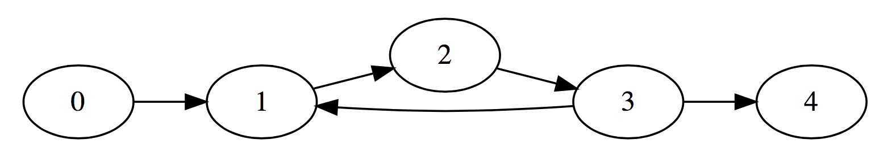

********
Relathon
********

Relathon is a domain-specific interpreted language for manipulating `binary relations`_. Relathon features a python-like syntax, user-defined functions, flow control, loops, built-in operations from relation algebra, and a very efficient relation datatype based on the `binary decision diagram`_.

Relathon can be used in two manners. Programs saved as .rel files can be run as scripts from the command line. Alternatively, commands can be sent to the relathon interpreter line-by-line in an interactive mode.

Getting Started
===============

.. code-block:: bash

    git clone https://github.com/Peter-Roger/relathon.git
    cd relathon/relathon
    python3 relathon.py

Requirements
------------

Relathon has only one dependency: `pyrel`_. Pyrel can be installed using pip. Instructions for installing pyrel can be found at the project page.

Preliminary
===========

Quoted from `wikipedia`_:

    In mathematics, a binary relation between two sets A and B is a set of ordered pairs (a, b) consisting of elements a of A and elements b of B; in short, it is a subset of the Cartesian product A × B. It encodes the information of relation: an element a is related to an element b if and only if the pair (a, b) belongs to the set.

    An example is the "divides" relation between the set of prime numbers P and the set of integers Z, in which each prime p is related to each integer z that is a multiple of p, but not to an integer that is not a multiple of p. In this relation, for instance, the prime 2 is related to numbers that include −4, 0, 6, 10, but not 1 or 9; and the prime 3 is related to numbers that include 0, 6, and 9, but not 4 or 13.

    Binary relations are used in many branches of mathematics to model concepts like "is greater than", "is equal to", and "divides" in arithmetic, "is congruent to" in geometry, "is adjacent to" in graph theory, "is orthogonal to" in linear algebra and many more. A function may be defined as a special kind of binary relation. Binary relations are also heavily used in computer science.

Structure of a Relathon Program
===============================

Relathon is a portmanteau of Relation Python because that is percisely what it is. If you are familiar with Python you will be comfortable writing relation programs in Relathon.

It was important that using Relathon required little overhead. It needed to feasibly permit line by line execution in an interactive console and writing small simple scripts needed to be seamless. Python's grammar emphasizes simplicity and readability by reducing boilerplate and organizing logical blocks with indentation. I decided to base Relathon's grammar off of Python for its demonstrated ease of use as a scripting language and with the idea that an already broad familiarity of the syntax would minimize the learning curve and encourage adoption. All keywords are inherited from python. Indentation is used to indicate a logical block. Relathon's syntax and grammar is practically a subset of Python's, but there are a few differences that will be highlighted. You can view the full grammar specification in Backus normal form in the file grammar.txt.

Keywords
---------

.. code-block:: text

    and        elif       import     pass
    break      else       None       return
    continue   False      not        True
    def        if         or         while

Types
-----

Relation
^^^^^^^^

The nexus of Relathon is the **Relation** datatype. Along with **functions**, relations form the basis of relathon programs and are the language's only true types. Other 'types' are available as lexemes simply for the convenience of passing arguments to certain builtin functions.

Internally relations use a very vast implemention based on the Binary Decision Diagram, but as an abstraction they are represented as boolean matrices (matrix with entries from the boolean domain B = {0,1}). Relathon operates with relations on a finite set. The cartesian product of a set of rows and a set of columns is a matrix. The true entries of the matrix denote the relation. A true (or set) entry at col *x* and row *y* indicates that x is related to y. When printing relations an 'X' denotes true (bit is set) and a '.' denotes false (bit is unset).

As an example,

Let A = {0,1,2,3}

The identity relation is defined as:

I = {(x,y) | (x,y) ∈ AxA and x = y}

I = {(0,0), (1,1), (2,2), (3,3)}

It corresponds to the identity matrix. This is demonstrated in relathon as follows:

.. code-block:: python

    # create a 4x4 identity relation
    rel = I(4,4)
    print(rel)

.. code-block:: text

    X...
    .X..
    ..X.
    ...X

Functions
^^^^^^^^^

The grammar productions related to Fuctions:

funcdef       ::= 'def' NAME paramlist (':' suite | '=' expr)

paramlist     ::= '(' [NAME, (',' NAME)* [,]] ')'

suite         ::= simple_stmt | NEWLINE INDENT stmt+ DEDENT

| **Function** definitions are similar to python function definitions. A function definition is introduced by the keywork "def" and followed by the function identifier, a parameter list, and a suite. The paramlist is a comma-separated parenthesized list of parameters. An indented block of statements beginning on the next line comprises the function suite.

Alternatively, a function definition can also occur all on a single line. Instead of the colon (":") that usually precedes the indented code block, an equal ("=") is used followed by a single expression. No return statement is necessary because the value of the evaluated expression is the implied return value.

These two functions are the same:

.. code-block:: python

    def transpose_composition(a,b):
        return (a*b)^

    def transpose_composition(a,b) = (a*b)^

Boolean
^^^^^^^
**Booleans** exist, but are actually themselves represented as relations. *True* is the universal relation of dimension 1x1. *False* is the empty relation of dimension 1x1.

.. code-block:: python

    # 1x1 universal relation
    R = True

    # 1x1 empty relation
    S = False

    # False (1x1 empty relation) will be assigned to G because R != S
    G = R == S

OrderedPairs
^^^^^^^^^^^^
**OrderedPairs** is a list of pairs (row, col) denoting which rows are related to which columns as an argument for several builtin functions.

.. code-block:: python

    # create ordered pairs with three entries
    pairs = [(0,0),(0,1),(0,2)]

    # create new 3x3 relation and set the bits in pairs
    R = new(3,3,pairs)
    print(R)

.. code-block:: text

    X..
    X..
    X..

int
^^^
**int** is used as an argument for certain builtin functions to specify dimension information.

float
^^^^^
**float** is used solely as the optional probability argument for the random function. It specifies the probability that a bit will be set when the function generates a random relation.

char
^^^^
**char** is a single character surrounded by quotes (e.g. 'a'). It is used solely as an argument for the *setchars* function which changes the chars used to represent the true and false values when a binary relation is printed.

Builtin Operators
---------------------------

========== ============
Relation   Operators
========== ============
**~** R    Complement
R **^**    Transposition
R **|** S  Union (join)
R **&** S  Intersection (meet)
R **\*** S Composition
========== ============

=========== =======================
Assignment  Operators
=========== =======================
R **=** S   Assignment
R **|=** S  Union assignment
R **&=** S  Intersection assignment
R **\*=** S Composition assignment
=========== =======================

=========== ===========
Boolean     Operators
=========== ===========
R **and** S boolean and
R **or** S  boolean or
**not** R   boolean not
=========== ===========

=========== =================
Inclusivity Operators
=========== =================
R **==** S  equals
R **!=** S  not equals
R **<** S   strict subset
R **>** S   strict superset
R **<=** S  subset
R **>=** S  superset
=========== =================

Builtin Functions
-----------------
*Italicized* parameters are optional.

======================================  ====================================================
Relation Functions                      Description
======================================  ====================================================
**new(** rel, *bits* **)**              create a new relation with size of given relation
**new(** rows, cols, *bits* **)**       create a new relation of given dimension
**copy(** rel **)**                     create a copy of a relation
**random(** rows, cols , *prob* **)**   create a new random relation
**vec(** rows, cols, vec **)**          create a new vector of given dimension and row vec
**vec(** rel, *vec* **)**               create a new vector of size rel and row vec
**empty(** rel **)**                    test whether rel is empty i.e. equal to O (the empty set)

**O(** rows, cols **)**                 return the empty relation of given dimension
**O(** rel **)**                        return the empty relation with same dimension as rel
**L(** rows, cols **)**                 return the universal relation of given dimension
**L(** rel **)**                        return the universal relation with same dimension as rel
**I(** rows, cols **)**                 return the identity relation of given dimension
**I(** rel **)**                        return the identity relation with same dimension as rel

**set(** rel, bits **)**                set bits in relation
**unset(** rel, bits **)**              unset bits in relation
**print(** \*args **)**                 print
**setchars(** one_ch, zero_ch **)**     change the chars used to print boolean matrix
======================================  ====================================================

Loops and Flow Control
----------------------

Flow control and loops work the same in Relathon as they do in Python.

If-statements
^^^^^^^^^^^^^

if_stmt ::= 'if' expr ':' suite ('elif' expr ':' suite)* ['else' ':' suite]

.. code-block:: python

    if condition:
        pass
    elif other_condition:
        pass
    else:
        pass

While-statements
^^^^^^^^^^^^^^^^

while_stmt ::= 'while' expr ':' suite ['else' ':' suite]

.. code-block:: python

    while condition:
        condition = update(condition)

Break and Continue
^^^^^^^^^^^^^^^^^^

A break statement terminates the loop. A continue statement skips the rest of the suite and continues the loop.

.. code-block:: python

    while condition:
        if some_condition:
            break
        elif other_condition:
            continue
        condition = update(condition)

Importing Modules
-----------------
A Relathon program can be written in one file then imported from another. Relathon modules are suffixed with '.rel'. To import your module named 'example.rel' write:

.. code-block:: python

    import example

Examples
========

Here are some examples that demonstrate what can be done with Relathon.

Closures
--------

R is transitive if and only if R² ⊆ R. The transitive closure R⁺ is the smallest relation that is both transitive and contains R. It can be computed by taking the entire union of R and successive powers of R (Rⁿ⁺¹ = R * Rⁿ).

R⁺ = R ∪ R² ∪ R³ ∪ R⁴ ...

Eventually R will stabilize and successive terms will no longer need to be unioned. Relathon can be used to compute this programmatically:

.. code-block:: python

    def transitive_closure(rel):
        power = rel
        partial = O(rel)
        closure = power
        while partial != closure:
            power = closure * power
            partial = closure
            closure = closure | power
        return closure

The reflexive transitive closure R* is the smallest relation that is both transitive, reflexive, and contains R.

R* = I ∪ R ∪ R² ∪ R³ ∪ R⁴ ...

.. code-block:: python

    def reflexive_transitive_closure(rel):
        power = I(rel)
        partial = O(rel)
        closure = power
        while partial != closure:
            power = power * rel
            partial = closure
            closure = closure | power
        return closure

.. code-block:: python

    rel = new(6,6,[(0,1),(1,3),(3,4),(4,5)])
    tc = transitive_closure(rel)
    rtc = reflexive_transitive_closure(rel)
    print(rel)
    print(tc)
    print(rtc)

.. code-block:: text

        .X....
        ...X..
        ......
        ....X.
        .....X
        ......

        .X.XXX
        ...XXX
        ......
        ....XX
        .....X
        ......

        XX.XXX
        .X.XXX
        ..X...
        ...XXX
        ....XX
        .....X

Graphs
------

Relations can be used to describe directed graphs. The pairs in the relation become the directed edges of the graph. The relation matrix is the graph adjacency matrix.

For example, consider the following relation R on A = {1,2,3,4,5}:

.. code-block:: python

    R = new(5,5,[(0,1),(1,2),(2,3),(3,1),(3,4)])
    print(R)

.. code-block:: text

    .X...
    ..X..
    ...X.
    .X..X
    .....

This is the corresponding directed graph:

One way to represent nodes in a graph is with a vector. A vector is a row constant relation where all of the columns are identical.

Let S be a relation on A. S is a vector if (x,y) ∈ S for some y ∈ A implies (x,y) ∈ S for each y ∈ A. In other words, S is a vector if and only if S = SL.

Let S be the vector on A representing the subset {0, 3}. To create this in Relathon:

.. code-block:: python

    S = vec(5,5,0) | vec(5,5,3)
    print(S)

.. code-block:: text

    XXXXX
    .....
    .....
    XXXXX
    .....

The set of predecessors of S is the relation R*S and the set of successors of S is the relation R^ * S:

.. code-block:: python

    pred = R * S
    succ = R^ * S
    print(pred)
    print(succ)

.. code-block:: text

    .....
    .....
    XXXXX
    .....
    .....

    .....
    XXXXX
    .....
    .....
    XXXXX

The successors vector (R^ * S), that is, the transpose of R composed with S, describes the nodes that are reachable in one step from S. The vector R*^ * S, that is, the transpose of the reflexive-transitive closure composed with S, describes the nodes that are reachable from S in *n* steps. This can be computed using Relathon:

.. code-block:: python

    def reachable(rel, vec):
        while not empty(~vec & rel^ * vec):
            vec = vec | rel^ * vec
        return vec

Using the graph R and the vector S as defined above:

.. code-block:: python

    nodes = reachable(R, S)
    print(nodes)

.. code-block:: text

    XXXXX
    XXXXX
    XXXXX
    XXXXX
    XXXXX

All rows are filled. This is what we expect because all nodes are reachable from node 0 and 3.

.. _binary decision diagram: https://en.wikipedia.org/wiki/Binary_decision_diagram
.. _binary relations: https://en.wikipedia.org/wiki/Binary_relation
.. _pyrel: https://github.com/Peter-Roger/pyrel
.. _KURE: https://www.informatik.uni-kiel.de/~progsys/kure2/
.. _wikipedia: https://en.wikipedia.org/wiki/Binary_relation